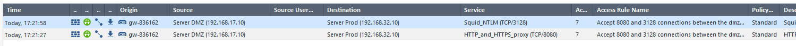

# RT0907 - TP Firewall

## Construction de la maquette

### Configuration des interfaces et routes du firewall Check Point


### Configuration des interfaces du firewall pfSense


#### Misconfiguration du firewall pfSense

1. Reparation de l'interface WAN en passant la negocation du speed en `auto`, et reset du MTU (1500).


2. Reparation du tcp timeout par l'adaptaion du parametre dans la rule autorisant la connexion ssh vers le serveur DMZ.


3. Reparation de la route par default en mettant utilisant la `172.16.17.3` au lieu de la `10.10.10.10`.


### Configuration des interfaces du firewall Alpine Linux (Production)


## Configuration des règles

Configurez vos FW selon les éléments ci dessous :

- le LAN de production peut aller sur Internet en utilisant http, https et ftp. De 8h à 19h, la bande passante allouée doit être limitée. Elle sera de 1M pour le surf et de 10 MB pour le FTP
  - FW PROD:
    1. Accept LAN PROD -> ANY on { tcp/21, tcp/80, tcp/443 } with rate limits during (08:00-19:00)
    2. Accept LAN PROD -> ANY on { tcp/21, tcp/80, tcp/443 }
  - FW DMZ:
    1. Accept LAN PROD -> NOT Internal Networks on { tcp/21, tcp/80, tcp/443 }

- la machine sur le LAN DMZ ne peut accéder à Internet que via le port tcp/8080
  - FW DMZ:
    1. Accept LAN DMZ -> NOT Internal Networks on tcp/8080

- la machine d'administration ne peut aller que sur les sites https de Google (8.8.8.8), Microsoft (12.12.12.12) et Avast (30.30.30.30)
  - FW ADMIN:
    1. Accept HOST ADMIN -> 8.8.8.8 on tcp/443
    2. Accept HOST ADMIN -> 12.12.12.12 on tcp/443
    3. Accept HOST ADMIN -> 30.30.30.30 on tcp/443
  - FW DMZ:
    1. Accept HOST ADMIN -> NOT Internal Networks on tcp/443

- la machine d'administration doit pouvoir faire du SCP sur le serveur DMZ et de production
  - FW ADMIN:
    1. Accept HOST ADMIN -> HOST PROD on tcp/22
    2. Accept HOST ADMIN -> HOST DMZ on tcp/22
  - FW PROD:
    1. Accept HOST ADMIN -> HOST PROD on tcp/22
  - FW DMZ:
    1. Accept HOST ADMIN -> HOST DMZ on tcp/22

- le LAN de la DMZ peut se connecter au LAN de production via les ports tcp/8080 et tcp/3128
  - FW DMZ:
    1. Accept LAN DMZ -> LAN PROD on { tcp/3128, tcp/8080 }
  - FW PROD:
    1. Accept LAN DMZ -> LAN PROD on { tcp/3128, tcp/8080 }

- le LAN de la DMZ peut se connecter au serveur de production en tcp/8000-9000
  - FW DMZ:
    1. Accept LAN DMZ -> HOST PROD on tcp/8000-9000
  - FW PROD:
    1. Accept LAN DMZ -> HOST PROD on tcp/8000-9000

- le LAN de production peut se connecter au serveur de la DMZ en http et en tcp/443
  - FW PROD:
    1. Accept LAN PROD -> HOST DMZ on { tcp/80, tcp/443 }
  - FW DMZ:
    1. Accept LAN PROD -> HOST DMZ on { tcp/80, tcp/443 }

- le LAN d'admininistration peut se connecter au serveur DNS de production mais pas au DNS DMZ
  - FW ADMIN:
    1. Accept LAN ADMIN -> HOST PROD on udp/53
  - FW PROD:
    1. Accept LAN ADMIN -> HOST PROD on udp/53

- le serveur de la DMZ peut se connecter via ssh au serveur de production
  - FW DMZ:
    1. Accept HOST DMZ -> HOST PROD on tcp/22
  - FW PROD:
    1. Accept HOST DMZ -> HOST PROD on tcp/22

- le serveur d'administration peut interroger tous les serveurs à l'aide de SMNP. Il peut recevoir des TRAP SNMP de tous les serveurs
  - FW ADMIN:
    1. Accept HOST ADMIN -> { HOST PROd; HOST DMZ } on udp/161
    2. Accept { HOST PROd; HOST DMZ } -> HOST ADMIN on udp/162
  - FW PROD:
    1. Accept HOST ADMIN -> HOST PROD on udp/161
    2. Accept HOST PROD -> HOST ADMIN on udp/162
  - FW DMZ:
    1. Accept HOST ADMIN -> HOST DMZ on udp/161
    2. Accept HOST DMZ -> HOST ADMIN on udp/162

- le serveur d'administration ne peut atteindre la base de données mysql sur l'IP publique 1.1.1.1 que si l'adresse source correspond à 99.99.99.99 (la correspondance sera faite sur le FW Check Point)
  - FW ADMIN:
    1. Accept HOST ADMIN -> HOST 1.1.1.1 on tcp/3306
    2. NAT 10.10.10.10 to 1.1.1.1:3306 -> 99.99.99.99 to 1.1.1.1:3306
  - FW DMZ:
    1. Accept HOST 99.99.99.99 -> HOST 1.1.1.1 on tcp/3306

- le serveur de production peut se connecter à l'IP publique 4.4.4.4 avec ssh version 2
  - FW PROD:
    1. Accept HOST PROD -> HOST 4.4.4.4 on tcp/22
  - FW DMZ:
    1. Accept HOST PROD -> HOST 4.4.4.4 on (ssh version 2)

> Une inspection protocolaire est necessaire, nftables seul, n'en est pas capable

- le serveur de prodcution peut se connecter au serveur de la DMZ en sftp
  - FW PROD:
    1. Accept HOST PROD -> HOST DMZ on tcp/22
  - FW DMZ:
    1. Accept HOST PROD -> HOST DMZ on tcp/22

- le serveur de la DMZ accepte les connexions du serveur de production et du LAN d'admininistration en SMTP, mais seulement si elles arrivent avec une adresse .10 (le nat sera sur le pfSense et la règle sur le Check Point doit prendre cela en compte)
  - FW PROD:
    1. Accept HOST PROD -> HOST DMZ on tcp/25
  - FW ADMIN:
    1. Accept LAN ADMIN -> HOST DMZ on tcp/25
    2. NAT LAN ADMIN to HOST DMZ:25 -> 10.10.10.10 to HOST DMZ:25
  - FW DMZ:
    1. Accept { HOST PROd; 10.10.10.10 } -> HOST DMZ on tcp/25

- Le serveur de la DMZ peut aller sur le serveur de production pour le DNS. Il ne peut y avoir de transfert de DNS
  - FW DMZ:
    1. Accept HOST DMZ -> HOST PROD on udp/53
  - FW PROD:
    1. Accept HOST DMZ -> HOST PROD on udp/53

> Les transferts DNS se font en tcp, donc une regle n'autorisant qu'udp est suffisant

- la serveur d'administration peut recevoir des sauvegardes. L'initiative de la connexion revient aux serveurs des différentes zones : depuis la production, la communication se fera en FTPs, pour la DMZ elle se fera via SCP
  - FW PROD:
    1. Accept HOST PROD -> HOST ADMIN on tcp/990
  - FW DMZ:
    1. Accept HOST DMZ -> HOST ADMIN on tcp/22
  - FW ADMIN:
    1. Accept HOST PROD -> HOST ADMIN on tcp/990
    2. Accept HOST DMZ -> HOST ADMIN on tcp/22

- le serveur de la production peut se connecter au serveur de la DMZ en utilisant le port tcp/445, si le port source de la machine est supérieur à 1024
  - FW PROD:
    1. Accept HOST PROD:>1024 -> HOST DMZ on tcp/445
  - FW DMZ:
    1. Accept HOST PROD -> HOST DMZ on tcp/445

- le serveur d'administration peut se connecter au serveur de la DMZ en IMAP si le flux arrive le mardi, le jeudi et le vendredi entre 8 et 17 heures
  - FW ADMIN:
    1. Accept HOST ADMIN -> HOST DMZ on tcp/143 only between 8h00:17h00 on { tue, thu, fri }
  - FW DMZ:
    1. Accept HOST ADMIN -> HOST DMZ on tcp/143

- depuis Internet, les utilisateurs peuvent se rendre sur le serveur de la DMZ en utilisant POP3s ou IMAP
  - FW DMZ:
    1. Accept NOT Internal Networks -> HOST DMZ on { tcp/143, tpc/995 }

- le serveur d'administration peut envoyer des email via le relais SMTP de Free (200.200.200.2)
  - FW ADMIN:
    1. Accept HOST ADMIN -> HOST 200.200.200.2 on tcp/25
  - FW DMZ:
    1. Accept HOST ADMIN -> HOST 200.200.200.2 on tcp/25

- les FW Check Point peuvent se mettre à jour en récupérant les sources à l'adresse 6.6.6.6 via le port tcp/18190. Les FW PfSense peuvent savoir s'il y a des mises à jour en vérifiant l'adresse 5.5.5.5 via le port tcp/50443.
  - FW ADMIN:
    1. Accept FW DMZ -> HOST 6.6.6.6 on tcp/18190
  - FW DMZ:
    1. Accept FW ADMIN -> HOST 5.5.5.5 on tcp/50443
    2. Accept FW DMZ -> HOST 6.6.6.6 on tcp/18190

### Config Alpine Linux (Production)

#### Rules summary

1. Accept LAN ADMIN -> HOST PROD on udp/53
1. Accept LAN DMZ -> LAN PROD on { tcp/3128, tcp/8080 }
1. Accept LAN DMZ -> HOST PROD on tcp/8000-9000
1. Accept HOST ADMIN -> HOST PROD on { tcp/22, udp/161 }
1. Accept HOST DMZ -> HOST PROD on { tcp/22, udp/53 }

1. Accept LAN PROD -> HOST DMZ on { tcp/80, tcp/443 }
1. Accept LAN PROD -> ANY on { tcp/21, tcp/80, tcp/443 } with rate limits during (08:00-19:00)
1. Accept LAN PROD -> ANY on { tcp/21, tcp/80, tcp/443 }
1. Accept HOST PROD -> HOST ADMIN on udp/162
1. Accept HOST PROD -> HOST 4.4.4.4 on tcp/22
1. Accept HOST PROD -> HOST DMZ on { tcp/22, tcp/25 }
1. Accept HOST PROD -> HOST ADMIN on tcp/990
1. Accept HOST PROD:>1024 -> HOST DMZ on tcp/445

#### Configuration

Fichier `/etc/sysctl.d/forward.conf`

```conf
net.ipv4.ip_forward = 1
```

Fichier `/etc/nftables.nft`

```conf
#!/usr/sbin/nft -f
# vim: set ts=4 sw=4:
# You can find examples in /usr/share/nftables/.

# Clear all prior state
flush ruleset

# Include definitions
include "/etc/defines.nft"

table inet filter {
    chain input {
        type filter hook input priority 0; policy drop;

        iifname lo accept \
        comment "Accept any localserver traffic"

        ct state { established; related } accept \
        comment "Accept traffic originated from us"

        log ct state invalid drop \
        comment "Drop invalid connections"

        log ip protocol icmp icmp type {
            echo-reply,  # type 0
            destination-unreachable,  # type 3
            echo-request,  # type 8
            time-exceeded;  # type 11
            parameter-problem,  # type 12
        } accept \
        comment "Accept ICMP"

        log iifname $nic_inet ip saddr $net_inet tcp dport ssh accept \
        comment "Accept SSH connections from the inet network for TP purposes"

        log prefix "[nftables] Inbound Denied: " counter drop \
        comment "Logging of denied inbound traffic"
    }

    chain output {
        type filter hook output priority 0; policy accept;
    }
}

# The state of stateful objects saved on the nftables service stop.
include "/var/lib/nftables/*.nft"

# Rules
include "/etc/nftables.d/*.nft"
```

Fichier `/etc/defines.nft`

```conf
# interfaces
define nic_inet = eth0
define nic_prod = eth1

# networks
define net_admin = 10.10.10.0/24
define net_dmz = 192.168.17.0/24
define net_inet = 172.16.17.0/29
define net_prod = 192.168.32.0/25

# some machines
define server_admin = 10.10.10.10
define server_dmz = 192.168.17.10
define server_prod = 192.168.32.10
```

Fichier `/etc/nftables.d/inet-filter-forward.nft`

```conf
table inet filter {

    limit lim_1mbps {
        comment "use to limit outgoing web traffic"
        rate over 1 mbytes/second
    }

    limit lim_10mbps {
        comment "use to limit outgoing ftp"
        rate over 10 mbytes/second
    }

    chain prod_in {
        log ip saddr $net_dmz ip daddr $net_prod tcp dport { 3128, 8080 } accept \
        comment "Accept 8080 and 3128 connections between the dmz network and the production network"

        log ip saddr $net_dmz ip daddr $server_prod tcp dport 8000-9000 accept \
        comment "Accept 8000-9000 connections from the dmz network to the production server"

        log ip saddr { $net_admin, $server_dmz } ip daddr $server_prod udp dport 53 accept \
        comment "Accept DNS connections between the administration network or the dmz server, and the production server"

        log ip saddr $server_admin ip daddr $server_prod ip protocol . th dport { tcp . 22, udp . 161 } accept \
        comment "Accept SSH and SNMP connections between the administration server and the production server"

        log ip saddr $server_dmz ip daddr $server_prod tcp dport 22 accept \
        comment "Accept SSH connections between the dmz server and the production server"
    }

    chain prod_out {
        log prefix "[nftables] Spoofing: " ip saddr != $net_prod drop \
        comment "Reject traffic not originating from the production network"

        log ip daddr $server_dmz tcp dport { 80, 443 } accept \
        comment "Accept HTTP and HTTPS to DMZ server"

        log meta hour "08:00"-"19:00" tcp dport { 80, 443 } limit name "lim_1mbps" drop \
        comment "Accept HTTP, HTTPS with a bandwidth limit between 08:00-19:00"

        log meta hour "08:00"-"19:00" tcp dport 21 limit name "lim_10mbps" drop \
        comment "Accept FTP with a bandwidth limit between 08:00-19:00"

        log tcp dport { 21, 80, 443 } accept \
        comment "Accept HTTP, HTTPS and FTP without limit the rest of the time"

        log ip saddr $server_prod ip daddr $server_dmz tcp dport { 22, 25 } accept \
        comment "Accept SSH, SMTP from production server to dmz server"

        log ip saddr $server_prod ip daddr 4.4.4.4 tcp dport 22 accept \
        comment "Accept SSH, SMTP from production server to 4.4.4.4"

        log ip saddr $server_prod ip daddr $server_admin ip protocol . th dport { udp . 162, tcp . 990 } accept \
        comment "Accept FTPS and SNMP trap connections between the production server and the administration server"

        log ip saddr $server_prod ip daddr $server_dmz tcp sport > 1024 tcp dport 445 accept \
        comment "Accept tcp/445 connections between the production server and the dmz server"
    }

    chain forward {
        type filter hook forward priority filter; policy drop;
        
        log ct state invalid drop \
        comment "Drop invalid connections"

        log ip protocol icmp icmp type {
            echo-reply,  # type 0
            destination-unreachable,  # type 3
            echo-request,  # type 8
            time-exceeded;  # type 11
            parameter-problem,  # type 12
        } accept \
        comment "Accept ICMP"

        oifname $nic_prod jump prod_in
        iifname $nic_prod jump prod_out

        ct state { established; related } accept \
        comment "Accept established and related traffic"

        log prefix "[nftables] Forward Denied: " counter drop \
        comment "Logging of denied forward traffic"
    }
}
```

### Config Check Point (DMZ)

#### Rules summary

1. Accept LAN DMZ -> LAN PROD on { tcp/3128, tcp/8080 }
1. Accept LAN DMZ -> HOST PROD on tcp/8000-9000
1. Accept HOST DMZ -> HOST PROD on { tcp/22, udp/53 }
1. Accept HOST DMZ -> HOST ADMIN on { tcp/22, udp/162 }

1. Accept LAN PROD -> HOST DMZ on { tcp/80, tcp/443 }
1. Accept { HOST PROd; 10.10.10.10 } -> HOST DMZ on tcp/25
1. Accept HOST ADMIN -> HOST DMZ on { tcp/22, tcp/143, udp/161 }
1. Accept HOST PROD -> HOST DMZ on { tcp/22, tcp/445 }

1. Accept NOT Internal Networks -> HOST DMZ on { tcp/143, tpc/995 }

1. Accept LAN PROD -> NOT Internal Networks on { tcp/21, tcp/80, tcp/443 }
1. Accept LAN DMZ -> NOT Internal Networks on tcp/8080
1. Accept HOST ADMIN -> NOT Internal Networks on tcp/443
1. Accept HOST 99.99.99.99 -> HOST 1.1.1.1 on tcp/3306
1. Accept HOST PROD -> HOST 4.4.4.4 on (ssh version 2)
1. Accept HOST ADMIN -> HOST 200.200.200.2 on tcp/25
1. Accept FW ADMIN -> HOST 5.5.5.5 on tcp/50443
1. Accept FW DMZ -> HOST 6.6.6.6 on tcp/18190

#### Configuration


### Config pfSense (Administration)

#### Rules summary

1. Accept { HOST PROd; HOST DMZ } -> HOST ADMIN on udp/162
1. Accept HOST PROD -> HOST ADMIN on tcp/990
1. Accept HOST DMZ -> HOST ADMIN on tcp/22

1. Accept LAN ADMIN -> HOST DMZ on tcp/25 .
1. Accept LAN ADMIN -> HOST PROD on udp/53 .
1. Accept HOST ADMIN -> HOST 1.1.1.1 on tcp/3306 .
1. Accept HOST ADMIN -> { 8.8.8.8, 12.12.12.12, 30.30.30.30 } on tcp/443 .
1. Accept HOST ADMIN -> HOST PROD on tcp/22 .
1. Accept HOST ADMIN -> HOST DMZ on tcp/22 keep
1. Accept HOST ADMIN -> { HOST PROd; HOST DMZ } on udp/161 .
1. Accept HOST ADMIN -> HOST DMZ on tcp/143 only between 8h00:17h00 on { tue, thu, fri }
1. Accept HOST ADMIN -> HOST 200.200.200.2 on tcp/25 .
1. Accept FW DMZ -> HOST 6.6.6.6 on tcp/18190 .

1. NAT LAN ADMIN to HOST DMZ:25 -> 10.10.10.10 to HOST DMZ:25
1. NAT 10.10.10.10 to 1.1.1.1:3306 -> 99.99.99.99 to 1.1.1.1:3306

#### Configuration


## Un peu de debug

1. quand vous aurez appliqué une politique sur un FW, vous ne pourrez plus le pinguer. Comment je peux savoir que le FW est en ordre de marche ?

> On peut initier une connexion tcp sur un port d'administration (principalement web, ou ssh), et vérifier que la session est établie.

2. quand vous allez configurer vos réseaux via VirtualBox, comment pouvez vous vous assurer que c'est bien configuré ?

> La première phase consiste à configurer les firewalls de manière à ce qu'ils laissent passer tout le trafic. Ensuite, on peut faire un ping vers les différents réseaux et vers l'Internet.

3. depuis les machines , initiez tous les flux comme indiqué dans la partie en bleu "configuration des règles" .

- le LAN de production peut aller sur Internet en utilisant http, https et ftp. De 8h à 19h, la bande passante allouée doit être limitée. Elle sera de 1M pour le surf et de 10 MB pour le FTP


- la machine sur le LAN DMZ ne peut accéder à Internet que via le port tcp/8080


- la machine d'administration doit pouvoir faire du SCP sur le serveur DMZ et de production


- le LAN de la DMZ peut se connecter au LAN de production via les ports tcp/8080 et tcp/3128




4. Insérez dans un fichier joint toutes les tables de routages des firewalls (de préférence en CLI)


5. Sur le serveur de la prod; montez un serveur ssh et depuis la machine d'admin, transférez un fichier de 10 Mo via SCP .

Si vous avez correctement configuré vos firewalls , vous devriez voir une trace dans les logs mais ca ne devrait pas fonctionner normalement ( ralentissement , ransfert qui ne va pas au bout) .

Quel est le souci de configuration ? Corrigez ce problème et testez à nouveau.
PI : Ce n'est pas un problème purement FW mais plutôt de la couche OS.

> Problème de configuration de l'interface WAN, en `10base-T` et MTU de `150`.
> Réparation de l'interface WAN du pfsense en passant la négocation de la vitesse en `auto`, et en réinitialisant le MTU (1500).
> Redémarrage du firewall

6. Sur le serveur de la DMZ, mettez également un serveur ssh et établissez une connexion depuis la machine d'admin .

lorsque la session est établie, faites un ls -l . Attendez 2 minutes et refaites un ls -l .

Si vous avez configuré correctement vos firewalls ( sur l'admin, si vous n'avez rien touché, c'est déjà fait ), vous devriez voir la connexion dans les logs . Le premier ls devrait fonctionner mais pas le deuxième. Sur le firewall d'admin, regardez la ligne qui correspond a ce flux, éditez l'objet.

Que constatez vous ? Corrigez la valeur et mettre quelque chose qui est plus proche du standard . Testez a nouveau , ca doit fonctionner correctement.

> Un tunning du TCP TIME-WAIT a ete mit en place sur la regle du pfsense autorisant la connexion ssh vers le serveur DMZ.
> La RFC 9293 demande à ce que l’état TIME-WAIT dure au moins deux fois le MSL (). De maniere generale on peut considerer un MSL de 2 minutes.


> Un réglage du TCP TIME-WAIT a été implémenté sur la règle du pfsense autorisant la connexion ssh au serveur DMZ.
> La RFC 9293 exige que l'état TIME-WAIT dure au moins deux fois le MSL (Maximum segment lifetime). D'une manière générale, on peut considérer que le MSL est de 2 minutes.
>
> `For this specification the MSL is taken to be 2 minutes. This is an engineering choice, and may be changed if experience indicates it is desirable to do so.` (source RFC 9293)
>
> On remplace donc par 240 sec, et on push la config.

7. Certains FW ont des outils particuliers qui peuvent simplifier le debug .

Sur le FW DMZ , lancez un tcpdump -npi sur l'interface qui est connectée à l'interco avec l'adresse du serveur PROD ( par exemple tcpdump -npi eth0 host 192.168.32.10 ) .

Depuis le serveur de la DMZ , ouvrez une session ssh sur le serveur de la prod et lancez quelques commandes .

Remettez vous sur le FW DMZ ( checkpoint ) , arretez le tcpdump avec un ctrl+c et lancez à la place un fw monitor -e "accept host(192.168.32.10);"

Depuis le serveur de la DMZ , ouvrez une session ssh sur le serveur de la prod et lancez quelques commandes .

comparez le résultat du fw monitor et du tcpdump . Que remarquez vous . Qu'est ce que la deuxieme commande vous apporte de plus comme informations ? que pouvez vous dire de I i o O ?

> Avec `fw monitor`, on ne voit que l'initialisation de la session tcp, contrairement à `tcpdump` où l'on voit tout le trafic qui passe.


Sur le FW DMZ, arrêtez le fw monitor . Relancez une session ssh depuis la machine DMZ vers le FW de prod lancez la commande fw tab -t connections -u -f . Retrouvez votre session .A quoi sert cette table ? Expliquez le résultat pour votre session .

> Cela nous permet de tracer les connexions et de savoir quelles règles de pare-feu les autorisent.

Effectuez les mêmes manipulations mais cette fois ci depuis le FW pfSense de la prod

> N/A

Pour les dump, utilisez les commandes pftop, iftop et en WebGUI Diagnostics > Packet Capture

Pour les sessions, regardez la fonction pfctl . Sinon vous pouvez retrouver la table en WebGUI dans les diags .

8. Récupérez le fichier de logs sur le serveur , regardez comment c'est représenté, essayez de retrouver les différentes informations . Faites un tableau avec les 10 sources les plus utilisées , les 15 destinations les plus utilisées, les 5 ports les plus utilisés et le pourcentage de drop et d'accept .

> Les logs peuvent être exportés au format csv la cli

```txt
[Expert@gw-836162:0]# fwm logexport -n -p -i 2024-02-06_000000.log -o 2024-02-06_000000.csv
```

- top 10 sources

```txt
[sylou@elitop TP1]$ cut -d';' -f28 fw_log.csv | sort | uniq -c | sort -rn | head -n 10
   6850 192.168.17.10
   4306 172.16.17.5
    712 172.16.17.6
    123 
     69 10.10.10.1
     10 172.16.17.2
      8 192.168.122.49
      5 192.168.32.10
      5 192.168.122.1
      1 src
```

- top 15 destinations

```txt
[sylou@elitop TP1]$ cut -d';' -f29 fw_log.csv | sort | uniq -c | sort -rn | head -n 15
   6852 192.168.122.1
   1068 172.16.17.3
    351 192.33.4.12
    309 202.12.27.33
    308 193.0.14.129
    307 192.5.5.241
    306 198.41.0.4
    298 192.36.148.17
    294 199.7.83.42
    275 199.7.91.13
    275 192.58.128.30
    274 192.228.79.201
    272 192.203.230.10
    271 128.63.2.53
    238 192.112.36.4
```

- top 5 ports

```txt
[sylou@elitop TP1]$ cut -d';' -f54 fw_log.csv | sort | uniq -c | sort -rn | head -n 5
  10796 53
    707 443
    555 
     13 137
      6 123
```

- drop/accept ratio

```txt
[sylou@elitop TP1]$ awk \
 -v accept="$(cut -d';' -f6 fw_log.csv | sort | uniq -c | grep -oP '(?=.*accept)[0-9]*')" \
 -v drop="$(cut -d';' -f6 fw_log.csv | sort | uniq -c | grep -oP '(?=.*drop)[0-9]*')" \
 'BEGIN {print (drop/(accept+drop)*100)}'
99.3176
```

> NB : Toutes ces opérations sont facilement réalisables via l'interface web [smartview] (https://172.16.17.3/smartview/) du firewall checkpoint.
> L'activation du `smart indexing` est recommandée.
