# RT0907 - TP Forensic

Le 25/11/2022 à partir de 21h45

## Qui a tenté de se connecter : donc ne pas prendre system, trouver l'utilisateur dont le type logon est 2

On commence par rechercher les journaux de connexion dans l'observateur d'événements.

On trouve un log de connexion à 21h45 sur le compte `le_prof`.

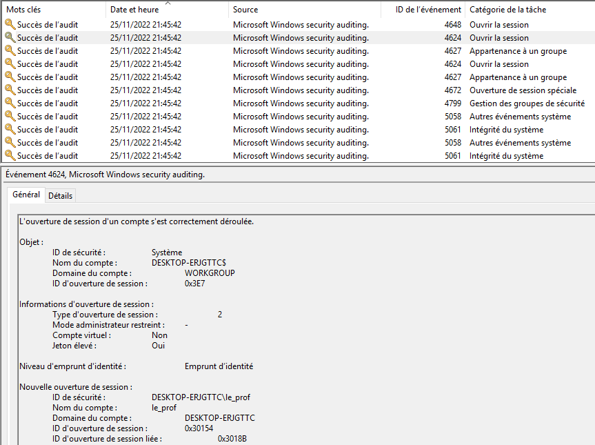

Information utile pour la suite :

```txt
ID d'ouverture de session liée :		0x3018B
```

## Quel fichier a été créé vers 21h48

En regardant les propriétés des différents documents trouvés dans `Documents récents`, on constate que le document `notes lpassr 2022-2023.ods` a été créé à 21h48.

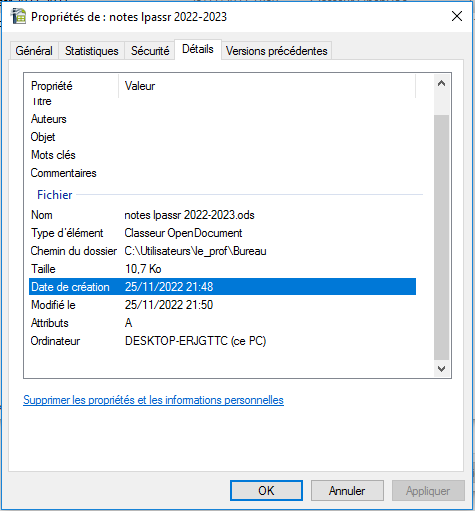

## A quelle heure s'est déconnecté cet utilisateur

On constate que l'utilisateur s'est déconnecté à `21:57`. On retrouve l'identifiant de session `0x3018B`.

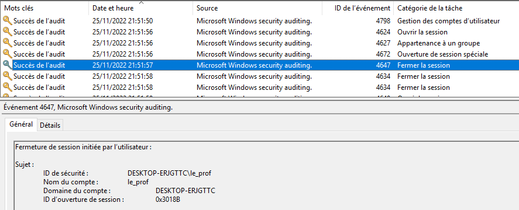

## Vers 22h00 il y a eu des tentatives de connexion (clément qui usurpé le compte de son père ??), combien d'erreur a t'il fait avant de rentrer ?

En filtrant les journaux par l'identifiant d'événement `4625`, nous trouvons `3` échecs de connexion vers 22:00.

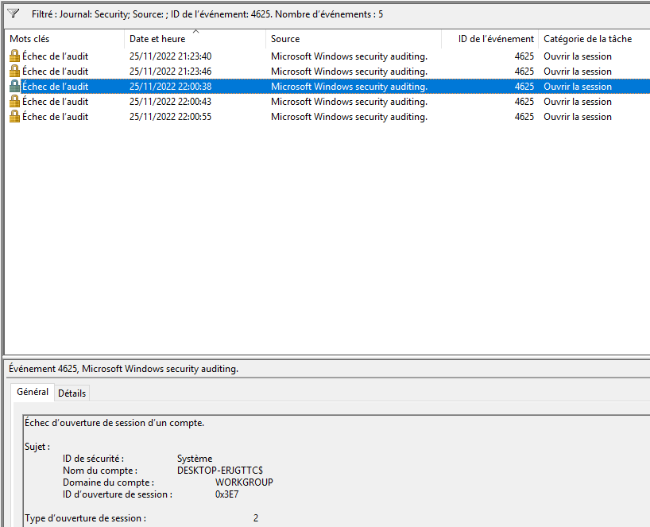

## Quel est le nom du premier répertoire créé sur le bureau, a quelle heure est-ce que cela a été fait ?

On vérifie dans les shellbags les dossiers créés sur le bureau après 22h00.

On trouve le dossier `sauve_notes` créé à `22:02`.

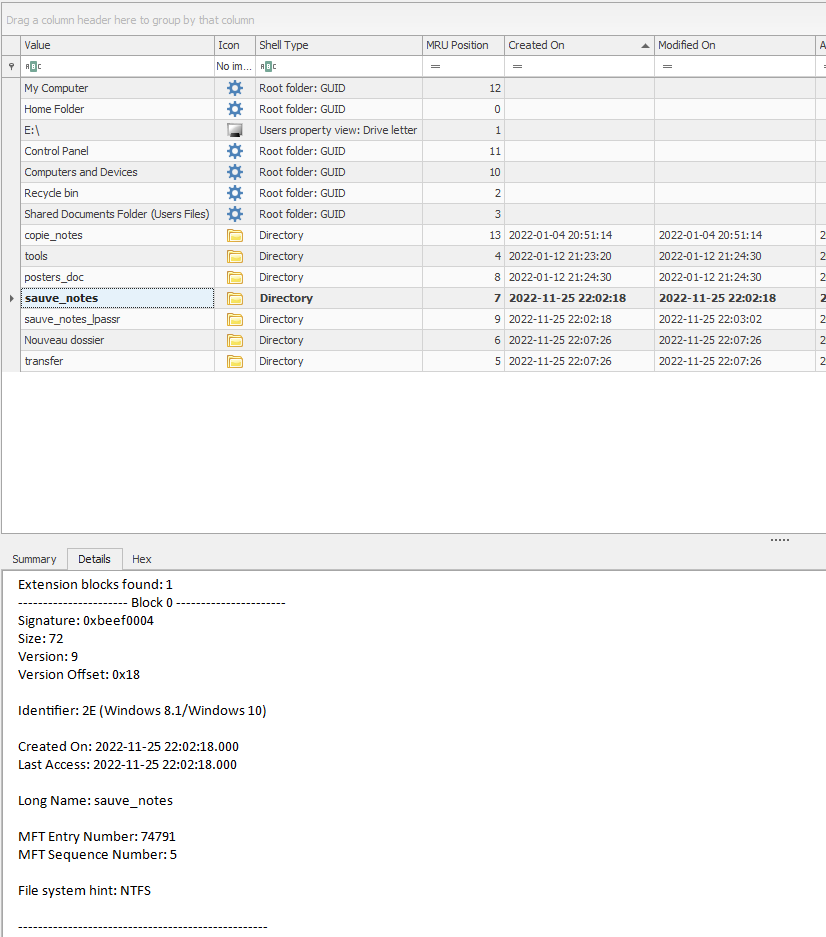

Information utile pour la suite :

```txt
MFT Entry Number: 74791
```

## En quoi a été renommé le répertoire ?

Grâce aux shellbags, on découvre que le dossier a été renommé en `sauve_notes_lpassr`.
On confirme qu'il s'agit bien d'un renommage, puisque le *MFT Entry Number* est également `74791`.

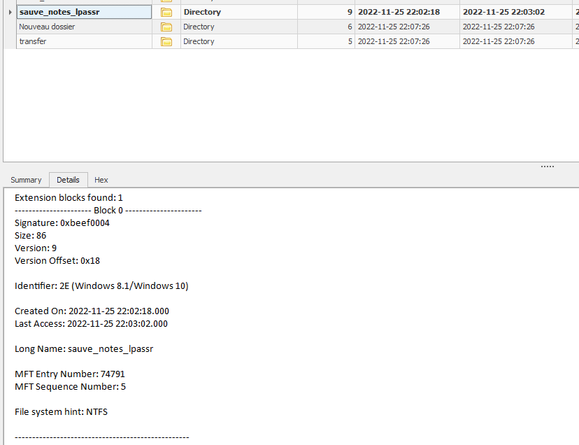

## Quel programme a été lancé vers 22h05 ? combien de fois est ce qu'il a été lancé ?

On regarde dans les prefetchs, et on trouve que `SCALC.EXE` a été exécuté vers 22h05.
Au total, ce programme a été exécuté `11` fois.

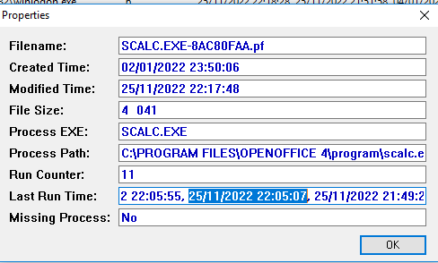

## Pouvez vous indiquer les répertoires/fichiers qui ont été créés, déplacés et dans quel ordre ?

Hypothèse 1 : On devrait pouvoir retrouver ces informations dans le `USN Journal`.

Malheureusement, après avoir récupéré ce dernier, on constate que l'on ne parvient à récupérer que les opérations des 10 dernières minutes.
C'est-à-dire, de `2022-11-25 22:27:21.7887650` à `2022-11-25 22:37:08.8073828`.

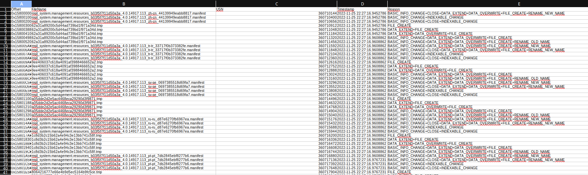

Hypothèse 2 : On devrait pouvoir retrouver ces informations à partir du `LogFile`.

Mais là aussi, il y a une limite aux logs conservés.
Le premier journal commence à `2022-11-25 22:26:25.3658078`.

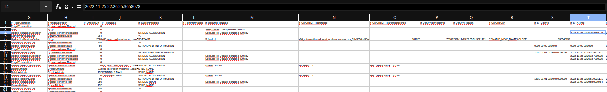

Il faudra donc se limiter aux traces restantes.

On peut récupérer un historique de création/accès en utilisant les `Documents récents`.

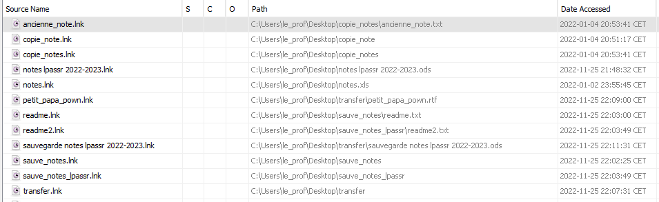

## A quelle heure est-ce qu'une connexion à distance a été réussie ?

Les logs montrent une connexion distante (type `10`) à `22:25`.

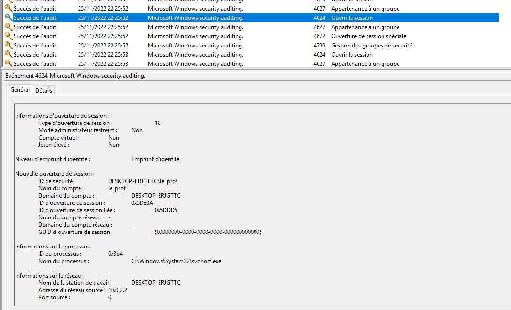

## Pouvez vous donner des détails sur le périphérique USB qui a été branché vers 22h27 ?

En utilisant `USBDeview`, on trouve une clé usb `SanDisk Extreme Pro` à 22:27.

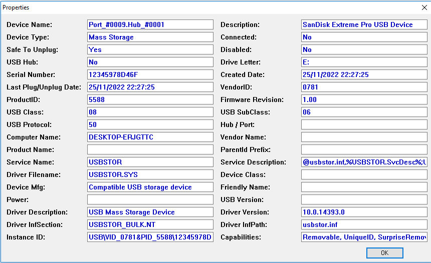

## Que pouvez-vous dire du raccourci 'save' sur le bureau ? qui l'a créé, d'où vient-il (pouvez vous donner le serial par exemple) ? quand a-t-il été fait ?

Le raccourci `save` a été créé par `le_prof`, le `25/11` à `21h30`, et provient d'un support amovible portant le numéro de série `AE0114FC`.

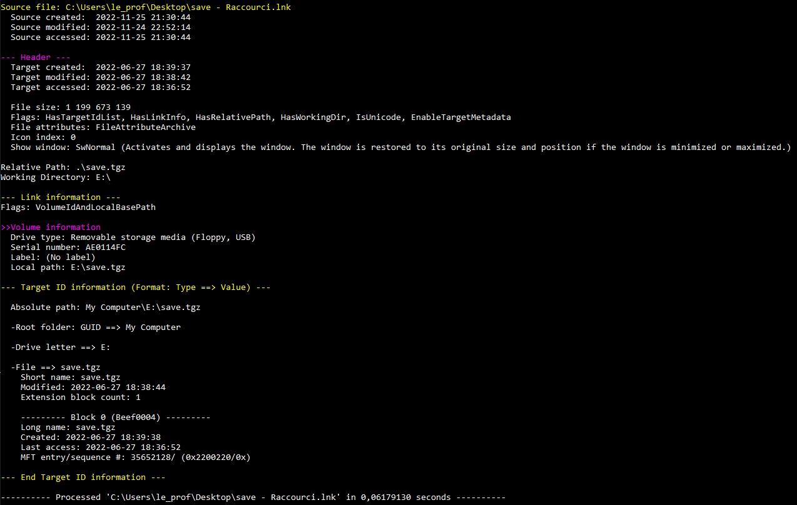

## Quel programme a été téléchargé a 22h32  ? Est-ce qu'il a été installé ? a-t-il été lancé ?

L'installeur `chrome` a été téléchargé à 22h32.
Il a été installé et exécuté.

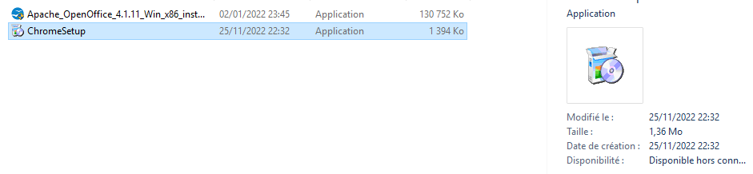

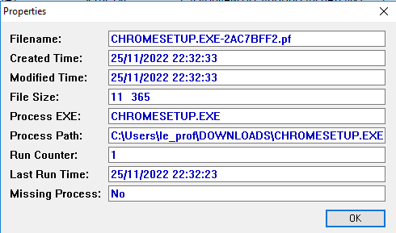

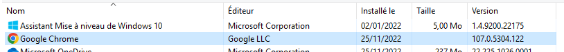

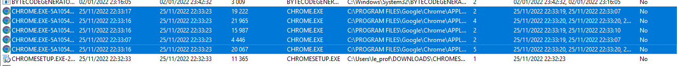

## Combien de fois a été lancé Edge a partir de 22h33 ? quelle est la dernière occurrence ?

Edge a été lancé `2` fois depuis 22h33.
Son dernier lancement a eu lieu à `22h35`.


## Quelles étaient les notes d'origine de Clément ?

On retrouve le dossier `transfer` dans la poubelle, avec le fichier `save notes lpassr 2022-2023` dans sa version de `22h17`.

Les notes originales de Clément étaient :

- `2` en python
- `2` en reseau
- `14` en windows

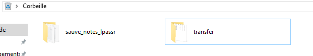

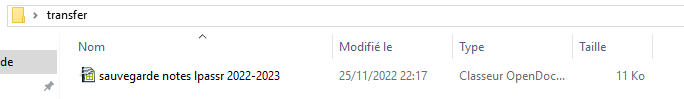

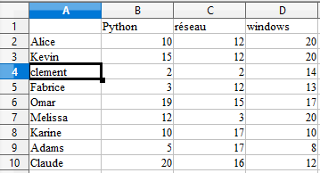
