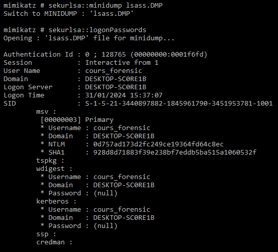
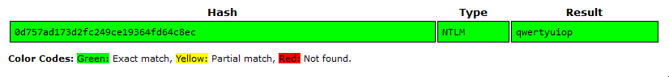
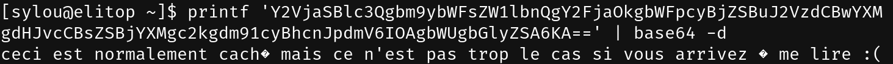
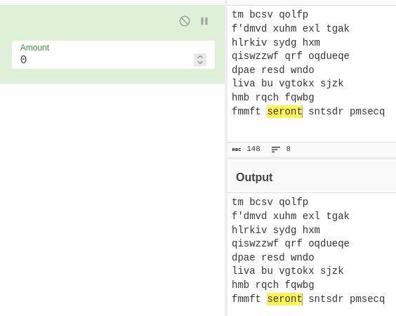
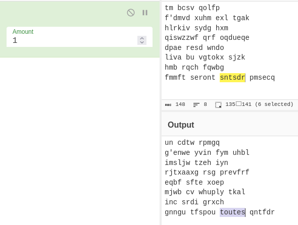
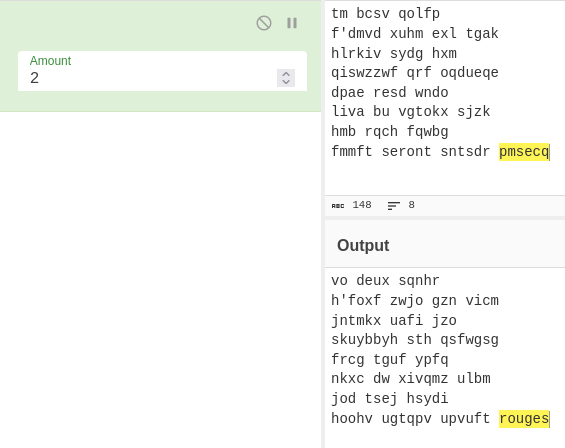
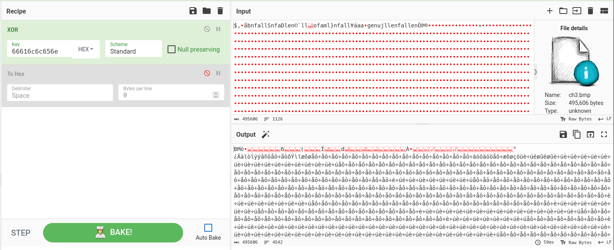
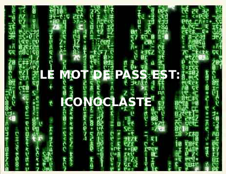

# RT0907 - TP mot de passe

## Q1

Maintenant que vous avez un accès sur la machine Windows,  ouvrez une session et remettez un mot de passe ( plus ou moins facile à trouver). Fermez la session et tester votre nouveau mot de passe.

Est ce que je peux retrouver mon mot de passe ??? et celui des autres personnes ?

> Lors du téléchargement de mimikatz (non sans mal), Windows defender panique et supprime mimikatz car il est détecté comme un virus.
> Après avoir désactivé Windows defender, on peut enfin passer à la suite.



> On fournit le hash NTLM à crackstation, et on trouve le mot de passe.



## Q2

Vous avez la chaîne ci dessous, saurez vous retrouver la méthode employée pour le coder et retrouver le mot de passe utilisé ?

> On peut voir la structure typique du base64, on essaie donc de la décoder.



## Q3

Retrouver les mots de passe ci-dessous (en utilisant les outils, pas internet, je veux avoir le détail des commandes)

```txt
checkpoint expert : $1$WBALVJDB$BznmpO.J3EgrWbQOfprEA.
checkpoint admin : bfab0767964c4991faa6a054f553368fb3f55e27
md5 : 4c3b6c7517e9f780744f6582f2d36fb6
md5 : ebc58ab2cb4848d04ec23d83f7ddf985
md5 : 6dd8518b7d93ae50cfa1a149bdda0050
md5 : cd8a78e99fee4149bf07aa711cb5663b
md5 : ad886b343e1111475261e29f293abfb5
```

> On utilise `hashcat` en mode 0 (Straight) avec un dictionnaire, ou en mode 3 (Brute-force), puis on spécifie le type de hachage.

- checkpoint expert (md5crypt)

```txt
cloud@ecs-sylou-gpu2:~$ hashcat -a 0 '$1$WBALVJDB$BznmpO.J3EgrWbQOfprEA.' -m 500 rockyou.txt --show
$1$WBALVJDB$BznmpO.J3EgrWbQOfprEA.:geheim12
```

- checkpoint admin (md5($salt.$pass))

```txt
cloud@ecs-sylou-gpu2:~$ hashcat -a 3 "964c4991faa6a054f553368fb3f55e27:bfab0767" --hex-salt -m 20 --show
964c4991faa6a054f553368fb3f55e27:bfab0767:hashcat!
```

- md5 (md5)

```txt
cloud@ecs-sylou-gpu2:~$ hashcat -a 0 -m 0 md5.txt rockyou.txt --show
ebc58ab2cb4848d04ec23d83f7ddf985:Bonjour
6dd8518b7d93ae50cfa1a149bdda0050:romaitalia3110
cd8a78e99fee4149bf07aa711cb5663b:1j6ki9pu32zv
ad886b343e1111475261e29f293abfb5:1j6ul4y.3

cloud@ecs-sylou-gpu2:~$ hashcat -a 3 -m 0 4c3b6c7517e9f780744f6582f2d36fb6 --show
4c3b6c7517e9f780744f6582f2d36fb6:Azerty123
```

## Q4

retrouvez vous a quelle application ce hash est associé et son mot de passe (3 points)

- $apr1$71850310$gh9m4xcAn3MGxogwX/ztb.

> En regardant la doc [Apache] (https://httpd.apache.org/docs/2.4/misc/password_encryptions.html), on constate qu'il s'agit d'un md5 avec 1000 rounds.

```txt
[sylou@elitop TP3]$ hashcat -a 0 -m 1600 '$apr1$71850310$gh9m4xcAn3MGxogwX/ztb.' rockyou.txt --show
$apr1$71850310$gh9m4xcAn3MGxogwX/ztb.:hashcat
```

- $DCC2$10240#tom#e4e938d12fe5974dc42a90120bd9c90f

> On suppose qu'il s'agit d'un hachage DCC2. Une recherche révèle que Domain Cached Credentials 2 (DCC2), MS Cache 2 est utilisé sous Windows.
> Ceci est confirmé par l'autodétection de hashcat.

```txt
2100 | Domain Cached Credentials 2 (DCC2), MS Cache 2 | Operating System
```

> On essaie de trouver, à l'aide d'un dictionnaire.

```txt
[sylou@elitop lab]$ hashcat -a 0 -m 2100 '$DCC2$10240#tom#e4e938d12fe5974dc42a90120bd9c90f' rockyou.txt --show
$DCC2$10240#tom#e4e938d12fe5974dc42a90120bd9c90f:hashcat
```

- fcf7c1b8749cf99d88e5f34271d636178fb5d130

> Ici, on utilise la détection automatique de hashcat.

```txt
The following 7 hash-modes match the structure of your input hash:

    # | Name                                                | Category
======+=====================================================+======================================
  100 | SHA1                                                | Raw Hash
 6000 | RIPEMD-160                                          | Raw Hash
  170 | sha1(utf16le($pass))                                | Raw Hash
 4700 | sha1(md5($pass))                                    | Raw Hash salted and/or iterated
18500 | sha1(md5(md5($pass)))                               | Raw Hash salted and/or iterated
 4500 | sha1(sha1($pass))                                   | Raw Hash salted and/or iterated
  300 | MySQL4.1/MySQL5                                     | Database Server
```

> Ensuite, on teste MySQL, cela semble plausible.

```txt
cloud@ecs-sylou-gpu2:~$ hashcat -a 3 'fcf7c1b8749cf99d88e5f34271d636178fb5d130' -m 300 --show
fcf7c1b8749cf99d88e5f34271d636178fb5d130:hashcat
```

## Q5

- [Encodage-ASCII](https://www.root-me.org/fr/Challenges/Cryptanalyse/Encodage-ASCII)

```txt
[sylou@elitop ~]$ printf "%b" "$(echo -e "4C6520666C6167206465206365206368616C6C656E6765206573743A203261633337363438316165353436636436383964356239313237356433323465" | sed 's/\(..\)/\\x\1/g')\n"
Le flag de ce challenge est: 2ac376481ae546cd689d5b91275d324e
```

- [Encodage-UU](https://www.root-me.org/fr/Challenges/Cryptanalyse/Encodage-UU)

```txt
[sylou@elitop lab]$ cat ch1.txt 

_=_ 
_=_ Part 001 of 001 of file root-me_challenge_uudeview
_=_ 

begin 644 root-me_challenge_uudeview
B5F5R>2!S:6UP;&4@.RD*4$%34R`](%5,5%)!4TE-4$Q%"@``
`
end

[sylou@elitop lab]$ uudecode -o output ch1.txt 
[sylou@elitop lab]$ cat output 
Very simple ;)
PASS = ULTRASIMPLE
[sylou@elitop lab]$
```

- [Hash-Message-Digest-5](https://www.root-me.org/fr/Challenges/Cryptanalyse/Hash-Message-Digest-5)

```txt
[sylou@elitop lab]$ hashcat -a 0 -m 0 '7ecc19e1a0be36ba2c6f05d06b5d3058' rockyou.txt --show
7ecc19e1a0be36ba2c6f05d06b5d3058:weak
```

- [Substitution-monoalphabetique-Cesar](https://www.root-me.org/fr/Challenges/Cryptanalyse/Substitution-monoalphabetique-Cesar)

> On constate qu'un mot est lisible à chaque rotation du code césar.
> On en déduit que chaque mot est codé avec une rotation décalée.







> Cela donne :

```txt
un deux trois
j'irai dans les bois
quatre cinq six
cueillir des cerises
sept huit neuf
dans un panier neuf
dix onze douze
elles seront toutes rouges
```

> Le flag est : ujqcsddessxsffes

- [Clair-connu-XOR](https://www.root-me.org/fr/Challenges/Cryptanalyse/Clair-connu-XOR)

> On analyse le header dans le fichier chiffré.

```txt
louis@solus ~/lab> xxd ch3.bmp | head
00000000: 242c 9ae3 626e 6661 6c6c 536e 6661 446c  $,..bnfallSnfaDl
00000010: 656e a960 6c6c 016f 6661 6d6c 7d6e 6661  en.`ll.ofaml}nfa
00000020: 6c6c a5e1 6161 7f67 656e 756a 6c6c 656e  ll..aa.genujllen
00000030: 6661 6c6c 656e d6de ae8c 8a9c 889c 938e  fallen..........
00000040: 949a 8395 9b8f 979b bb8d 838a 9096 8395  ................
```

> On nous dit qu'il s'agit d'un fichier BMP.
> Je crée donc un fichier BMP avec GIMP, juste pour avoir un référentiel.

```txt
louis@solus ~/lab> xxd foo.bmp | head
00000000: 424d ba75 0000 0000 0000 8a00 0000 7c00  BM.u..........|.
00000010: 0000 6400 0000 6400 0000 0100 1800 0000  ..d...d.........
00000020: 0000 3075 0000 232e 0000 232e 0000 0000  ..0u..#...#.....
00000030: 0000 0000 0000 0000 ff00 00ff 0000 ff00  ................
00000040: 0000 0000 0000 4247 5273 0000 0000 0000  ......BGRs......
```

> On remarque que la ligne `00000030` ne contient que des zéros en hexadécimal sur notre référence.
> On peut donc espérer qu'il en est de même pour tous les en-têtes de fichiers BMP.
>
> On récupère directement la clé utilisée pour le XOR, car le XOR ne devrait pas avoir modifié la clé de chiffrement sur les zéros.

```txt
00000030: 6661 6c6c 656e d6de ae8c 8a9c 889c 938e  fallen..........
```

> On essaie donc d'utiliser la clé de 48 bits `6661 6c6c 656e` pour le XOR.



> Et le fichier original est trouvé



> En regardant la ligne `00000030` dans le fichier de sortie, on constate que la clé de 48 bits est tout juste passé dans la zone de zéro.

```txt
00000000: 424d f68f 0700 0000 0000 3600 0000 2800  BM........6...(.
00000010: 0000 cf01 0000 6401 0000 0100 1800 0000  ......d.........
00000020: 0000 c08f 0700 130b 0000 130b 0000 0000  ................
00000030: 0000 0000 0000 b0bf c2e0 eff2 eefd ffe2  ................
00000040: f1f4 e5f4 f7e3 f2f5 ddec efe6 f5f8 e5f4  ................
```
